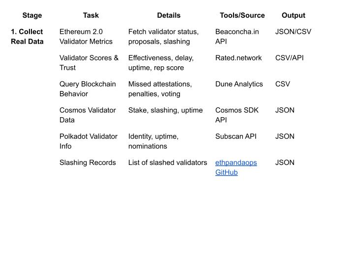
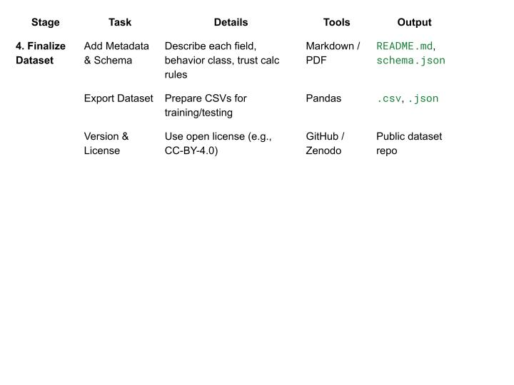
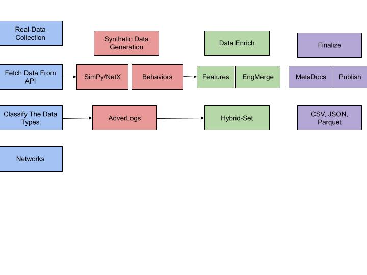

## Title: *Hybrid Dataset Construction for AI-Driven Validator Selection in Proof-of-Stake Blockchain Networks*

 

### Abstract
This proposal presents a systematic plan to develop a hybrid dataset for AI-based validator selection in Proof-of-Stake (PoS) blockchain environments. The dataset will be constructed through a four-phase process: (1) collecting real-world validator metrics from leading PoS blockchains (Ethereum 2.0, Cosmos, Polkadot), (2) generating synthetic logs via agent-based simulation for controlled behavior labeling, (3) enriching the dataset with engineered features and behavioral annotations, and (4) finalizing the dataset for reproducible AI experimentation. The hybrid dataset will enable supervised learning, multi-agent reinforcement learning (MARL), and explainability integration, contributing to more secure, transparent, and intelligent validator selection mechanisms.

## **1. Introduction and Background**

### **Problem Statement**

Proof-of-Stake (PoS) consensus techniques have changed the way blockchain security works by providing energy-efficient and scalable options to Proof-of-Work (PoW).  PoS systems do have some weaknesses, though.  Long-range assaults, Sybil manipulation, stake grinding, and validator collusion are still major concerns to network security and decentralization.  How validators are chosen and watched over time is one of the most important parts of PoS security.  If you don't choose the right validator set, it could lead to network centralization, unjust rewards distribution, lower fault tolerance, and even governance capture.

Still, the datasets that are now out there on PoS validator procedures are incomplete and don't have the depth of meaning that advanced AI-based decision-making needs.  Websites like beaconcha.in, Rated.network, and Subscan make data available to the public that shows things like uptime, slashing history, and stake allocation in real time.  These datasets, on the other hand, are not structured, do not have behavioral labeling (for example, identifying bad or malicious validators), and do not support time-series modeling or reward-based feedback mechanisms that are necessary for machine learning applications like Multi-Agent Reinforcement Learning (MARL).

Also, public datasets don't have any identified behavioral patterns (such Sybil validators, lazy participants, or selfish nodes), which makes it harder to train and test AI models that focus on choosing the best validators.  The fact that there aren't any defined benchmarking datasets for AI experiments in blockchain research is still a big problem for reproducibility, comparative evaluation, and open research.

### **1.2 Motivation and Significance**

This proposal is driven by the need to bridge the gap between raw PoS validator data and its practical usability in AI-driven validator selection and governance research. A robust dataset should enable:

- Accurate modeling of validator behavior in both cooperative and adversarial settings.

- Integration of trust and fairness considerations in validator selection through engineered metrics.

- Support for learning-based frameworks such as supervised classification, imitation learning, and multi-agent reinforcement learning (MARL).

- Explainability and interpretability of decisions made by AI agents using tools such as SHAP and LIME.

The proposed hybrid dataset—combining real-world validator metrics with synthetically generated behavioral data—will facilitate the training, benchmarking, and validation of AI algorithms designed to enhance trust, transparency, and performance in PoS ecosystems. By introducing controlled adversarial behaviors via simulation, the dataset will allow rigorous testing of AI robustness in threat-prone validator environments. In addition, the inclusion of explainability annotations and engineered trust scores will encourage accountability in AI decision-making, which is crucial for blockchain governance applications.

### **1.3 Literature Review**

Existing works on validator behavior often rely on proprietary or siloed datasets that are not publicly reproducible. Research efforts have either focused on theoretical analysis of validator incentives or empirical metrics derived from APIs and blockchain explorers. Platforms like beaconcha.in, Rated.network, and Subscan provide rich but unstructured data, lacking temporal continuity or behavioral context necessary for AI applications.

On the other hand, simulation environments such as Tenderbake or agent-based frameworks for blockchain consensus offer insights into validator interactions under various protocol designs. However, they do not generate labeled, reusable datasets suited for training AI agents in reinforcement learning environments. Moreover, these environments rarely include ground-truth annotations such as validator class (e.g., honest, Sybil) or time-varying trust scores that are essential for supervised learning and explainability studies.

Our work proposes to integrate these two worlds: the realism of on-chain validator metrics and the control of synthetic simulation environments. By unifying these sources and enriching them with additional annotations and labels, we aim to produce a reusable, well-documented, and benchmark-ready dataset that will accelerate research in AI-guided PoS validator selection, adversarial behavior detection, and governance transparency.

## **2. Dataset Description**

This section outlines the multi-phase methodology for constructing a hybrid dataset tailored to the needs of AI-driven validator selection in Proof-of-Stake (PoS) blockchain networks. The proposed dataset will combine real-world validator telemetry with synthetically simulated behaviors, enriched with engineered features and annotations. The entire process follows a four-phase pipeline: Collect → Generate → Enrich → Finalize.

### **2.1 Data Source and Collection Methodology**

The initial phase involves collecting high-fidelity validator data from active PoS networks, including Ethereum 2.0, Cosmos Hub, and Polkadot. These data are obtained through open-access APIs and public dashboards such as:

- Beaconcha.in and Rated.network for Ethereum 2.0

- Cosmos SDK REST API and block explorers for Cosmos

- Subscan.io and Dune Analytics for Polkadot and parachains

The collected metrics include:

- Validator ID and timestamp

- Uptime percentages

- Missed attestations or proposals

- Slashing and reward history

- Staking amount and delegation details

These logs reflect actual validator behavior and provide the empirical backbone of the dataset, ensuring that the machine learning models are grounded in real-world dynamics and performance.

#### **2.2 Generate Synthetic Data**

To complement and extend the real-world data, this phase employs an agent-based simulation environment developed in Python, using libraries such as SimPy, NetworkX, and optionally Gym. The simulation environment mimics a PoS blockchain network where each validator agent operates under a predefined behavioral profile, such as:

- Honest --> follows protocol strictly  
- Lazy -->  misses blocks intermittently
- Selfish --> optimizes personal reward at the cost of consensus 
- Sybil --> controls multiple identities to gain influence
- Long-range attackers --> rewrites historical chains  

Each simulated run produces time-stamped logs of validator actions, decisions, and outcomes. These synthetic datasets provide behaviorally labeled ground truth, enabling supervised learning and MARL experimentation under controlled adversarial scenarios.

#### **Enrich the Dataset**

In this stage, both real and synthetic datasets are integrated and enriched with additional engineered features to facilitate advanced analytics and learning tasks. These enhancements include:

- ***Trust scores:*** A dynamic, composite score computed based on missed blocks, uptime, and slashing history.  
- ***Message Entropy:*** A measure of randomness or deviation in consensus-related messages.  
- ***Peer Feedback:***  Ratings inferred from interactions or network topology.  
- ***Temporal Patterns:*** Validator actions tracked across epochs for time-series modeling  

Behavioral labels are applied using rule-based heuristics and verified simulation states. This results in a hybrid dataset that combines real-world authenticity with simulation-derived control, supporting both supervised classification and multi-agent reinforcement learning (MARL) use cases.

#### **Finalize the Dataset**

The final phase focuses on packaging, documentation, and publication to ensure reproducibility, transparency, and community usability. Key activities include:

- Exporting data in structured formats such as .csv and .json

- Documenting all fields including feature descriptions, data types, and valid ranges

- Generating metadata files and schema documentation

- Assigning version numbers for reproducibility

- Publishing the dataset under an open license on platforms such as GitHub

This ensures that future researchers can seamlessly access, understand, and build upon the dataset for PoS security, fairness, and governance research.

### **2.5 Data Collection Pipeline Overview**

The diagram below illustrates the end-to-end roadmap of the dataset development process. It captures the dual-source design (real + synthetic), highlights data enhancement steps, and shows how all artifacts are eventually unified into a standardized dataset ready for machine learning research.

### **2.6 Summary**

The methodology for constructing the dataset employs a methodical, four-phase procedure.  The initial step involves gathering authentic validator logs from operational blockchain networks and incorporating simulated, behavior-labeled data into them.   Incorporating artificial variables such as trust scores and peer assessments into the dataset enhances its behavioral context.   The result is a robust, heterogeneous dataset applicable for various AI research in PoS validator security, encompassing supervised learning, multi-agent reinforcement learning training, and explainable AI experiments.

## **3. Methodology**

The proposed methodology outlines the systematic approach adopted to construct, validate, and utilize a hybrid dataset aimed at advancing AI-driven validator selection in Proof-of-Stake (PoS) blockchain networks. This approach extends the **four-phase pipeline** presented in Section 2—**Collect → Generate → Enrich → Finalize**—into an experimental research framework that enables both **supervised learning** and **Multi-Agent Reinforcement Learning (MARL)**, while embedding explainability for interpretability and accountability.

### **3.1 Training of Multi-Agent Reinforcement Learning (MARL) Agents**

The hybrid dataset will be employed to train MARL agents capable of selecting optimal validators under dynamic network conditions and potential adversarial threats. The training framework will leverage the **Proximal Policy Optimization (PPO)** algorithm, implemented in the **Stable-Baselines3** library, due to its stability and efficiency in large state-action spaces.

The MARL design will incorporate:

- **State Representation:** Multi-dimensional feature vectors including validator uptime, missed attestations, slashing history, trust scores, peer ratings, and consensus deviation metrics.  
- **Temporal Context:** Use of sequential observation windows to capture evolving validator behavior patterns over multiple epochs.  
- **Action Space:** Selection or ranking of validators based on predefined constraints (e.g., number of active slots).  
- **Reward Function:** Balanced between consensus performance, security (avoiding malicious validators), and diversity of selection to prevent centralization.

This training approach will enable agents to optimize validator selection policies not only for performance but also for **network trustworthiness and resilience** against malicious strategies such as Sybil attacks or long-range forks.

### **3.2 Evaluation of Trust Score Dynamics**

An essential part of the methodology involves monitoring and analyzing **trust score dynamics** over time, both in simulated and real-world contexts. Trust scores will be computed per epoch using a weighted aggregation of key performance indicators such as uptime, block proposal frequency, slashing events, and consensus participation.

This evaluation will focus on:

- **Stability:** Measuring whether the MARL policy sustains high trust levels across extended operation periods.  
- **Adaptability:** Assessing the ability of the model to adjust to changes in validator performance, network topology, or participation rates.  
- **Resilience:** Testing robustness under injected adversarial conditions, such as the sudden appearance of malicious validators or coordinated attacks.

By analyzing temporal trust score trajectories, the methodology ensures that the proposed AI system can maintain a reliable validator set over time rather than optimizing for short-term rewards alone.

### **3.3 Explainability and Fairness Validation**

Given the critical role of validator selection in PoS security and governance, **explainability** is essential. The methodology integrates **SHAP (SHapley Additive exPlanations)** and **LIME (Local Interpretable Model-agnostic Explanations)** to quantify and visualize the influence of individual features on the model’s decisions.

- **SHAP:** Provides a global and local feature attribution analysis to understand which factors (e.g., uptime, stake, peer ratings) most influence validator selection across multiple decision instances.  
- **LIME:** Generates local surrogate models to explain individual selection decisions, offering transparency into one-off choices made by the MARL agent.  

These explanations will be recorded as **explanation vectors** in the dataset, enabling independent auditing and fairness analysis. Such interpretability is crucial for detecting potential biases (e.g., consistent preference for high-stake validators at the cost of decentralization) and ensuring compliance with fairness principles in validator governance.

## **4. Ethical Considerations and Data Management**

Ethical compliance and robust data management practices underpin the construction and dissemination of the proposed dataset. This section addresses **privacy**, **security**, and **data-sharing protocols** to ensure integrity and trustworthiness.

### **4.1 Privacy and Confidentiality**

- No **Personally Identifiable Information (PII)** will be collected or stored.  
- Validator identifiers from real-world data sources will either be anonymized or represented by public blockchain keys that are already publicly accessible.  
- All synthetic data will be generated within a controlled simulation environment, ensuring no linkage to private or sensitive identities.

### **4.2 Data Storage and Security**

- During preprocessing and simulation, all intermediate and raw data will be stored in secure, access-controlled local environments.  
- Backups will be maintained in a **private GitHub repository**, protected using **encrypted GitHub Secrets** for authentication.  
- Upon finalization, the dataset will be archived on reputable long-term hosting platforms such as **Zenodo** or **Hugging Face Datasets**, ensuring data integrity and persistent accessibility.

### **4.3 Data Sharing and Dissemination**

- The dataset will be released under the **Creative Commons Attribution 4.0 International (CC-BY-4.0)** license, promoting academic reuse and derivative work.  
- A complete **documentation package** will accompany the dataset, including:
  - Detailed feature descriptions and schema definitions  
  - Data collection and simulation methodologies  
  - Example usage scripts in Python for loading, preprocessing, and integration into AI workflows  
- Public access will be provided through a **dedicated GitHub repository**, and a **DOI (Digital Object Identifier)** will be assigned for citation in academic publications.

## **5. Expected Outcomes and Impact**

### **5.1 Anticipated Results**

At the conclusion of the project, the following deliverables are expected:

1. A **publicly accessible hybrid dataset** combining real-world validator telemetry with simulation-generated behavioral labels.  
2. A **benchmark-ready simulation environment** for testing MARL algorithms in PoS security contexts.  
3. An integrated **XAI annotation layer**, enabling interpretability and fairness assessment of validator selection models.

### **5.2 Potential Impact**

The release of this dataset and its accompanying simulation framework will have significant academic and industrial impact:

- **For Researchers:** Provides a reproducible, labeled dataset for testing AI-based validator selection algorithms, addressing the lack of standardized benchmarks in this domain.  
- **For Blockchain Developers:** Offers insights into trust-aware selection mechanisms that can improve decentralization, fairness, and security in PoS consensus.  
- **For Governance Bodies:** Supports transparency and accountability in validator selection through explainability tools, reducing risks of centralization or bias.  
- **For the Broader Community:** Encourages open science and knowledge sharing by releasing all resources under an open license with comprehensive documentation.

